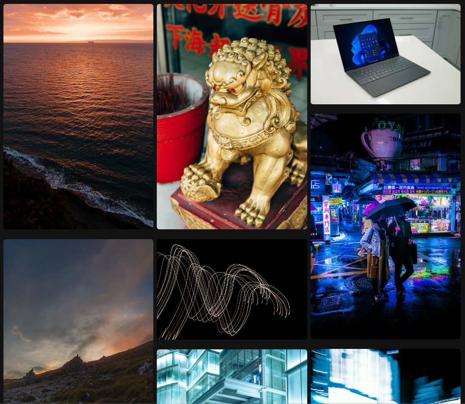

# 📖 Índice
* <a href="#-Sobre">❓ Sobre o projeto</a>
* <a href="#-Demonstração">🖼 Demonstração</a>
* <a href="#-Como-executar-o-projeto">🚀 Como executar o projeto</a>

* <a href="#-Tecnologias">⚡ Tecnologias</a>
* <a href="#-Autor">🙋‍♂️ Autor</a>

## Sobre
 Essa galeria de imagens foi feita sem a utilização de grid nem de flexbox, foi utilizado um conceito bem pouco conhecido do css que é as columns.

## Demonstração

## Tecnologias
- Html
- Css 3